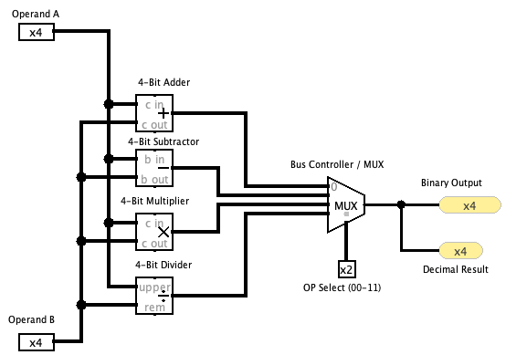

# Digital Electronics Assignment 4
## Binary Arithmetic Calculator

Here is the circuit design for my calculator:



## 🕹️ Functionality
The operation is determined by the **OP Select (00-11)** input:

| OP Select | Operation | Description |
|:---:|:---|:---|
| **00** | **Addition** | Adds Operand A and B using a 4-Bit Adder. |
| **01** | **Subtraction** | Subtracts Operand B from A using a 4-Bit Subtractor. |
| **10** | **Multiplication** | Multiplies Operand A and B using a 4-Bit Multiplier. |
| **11** | **Division** | Divides Operand A by B using a 4-Bit Divider. |

## 🏗️ Architecture
* **Inputs:** Two 4-bit wide input pins (Operand A & B).
* **Control:** One 2-bit selection pin for the MUX.
* **Arithmetic Units:** * 4-Bit Adder (with Carry-out support).
    * 4-Bit Subtractor (with Borrow-out support).
    * 4-Bit Multiplier.
    * 4-Bit Divider (providing Quotient and Remainder).
* **Outputs:** Displays results in both **Binary** and **Decimal** (Hex/Digit) formats for easy verification.

---

## 🛠️ How to Run
1.  Download and install [Logisim](http://www.cburch.com/logisim/) or [Logisim-evolution](https://github.com/logisim-evolution/logisim-evolution).
2.  Clone this repository:
    ```bash
    git clone [https://github.com/pePiangpi/Digital-Electronics-Computer-Architecture.git](https://github.com/pePiangpi/Digital-Electronics-Computer-Architecture.git)
    ```
3.  Open `4CalculationWithController.circ` in Logisim.
4.  Use the **Poke Tool** to change the input values and the OP Select code to see real-time results.
